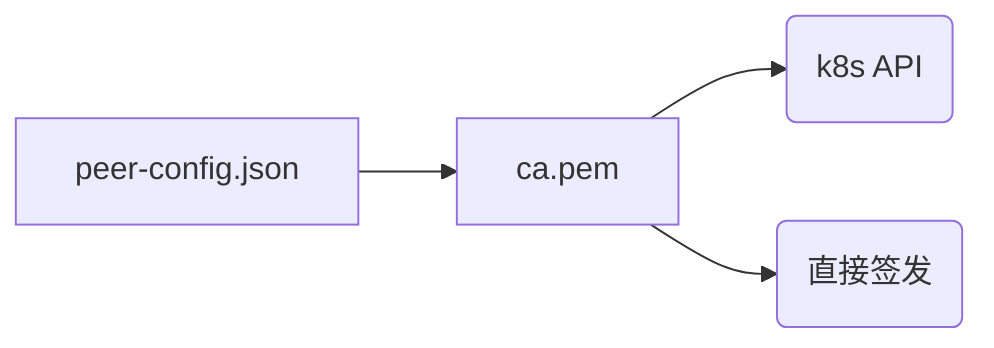

在k8s应用注入自签发的TLS/SSL证书有两种思路：1.使用certificates.k8s.io API 进行签发。2. 直接利用自己的CA证书进行签发。一般推荐第二种方法，本文记录了两种方法的完整实践并最后将其转换为JAVA的使用格式。
<!-- more -->
## 零 前言
### 流程图
阅读顺序参照下图

### 比较
直接签发方式是传统方式，只不过是使用了secret技术进行传递而已（换成nfs也可以），本身与k8s没有关系
certificates.k8s.io API 方式一般用于kubernetes内部组件，一般不建议与业务系统耦合。
## 一 创建证书签名请求配置（peer-config.json）

这个东西用于确定最终签发的目标证书的内容，示例如下：
这个配置生成的证书可用于linshenkx.com做https用（建议hosts把可能用到的都写上，特别是一个证书给多个节点用的情况，否则以后用的时候会有证书hostname不匹配的警告）
```yaml
{
  "hosts": [
    "linshenkx.com"
  ],
  "CN": "linshenkx",
  "key": {
    "algo": "ecdsa",
    "size": 256
  }
}

```
## 二 获取CA证书（ca.pem）
### 1. 准备好openssl工具
下载及使用参考：https://kubernetes.io/zh/docs/concepts/cluster-administration/certificates/#cfssl
如下：
```shell
curl -L https://pkg.cfssl.org/R1.2/cfssl_linux-amd64 -o cfssl
curl -L https://pkg.cfssl.org/R1.2/cfssljson_linux-amd64 -o cfssljson
curl -L https://pkg.cfssl.org/R1.2/cfssl-certinfo_linux-amd64 -o cfssl-certinfo
mv cfssl* /usr/local/bin/
chmod +x /usr/local/bin/cfssl*

```
### 2. 创建 CA证书签名申请 配置文件（ca-csr-config.json）
这个东西即代表CA本身的概念，可用于生成CA的公钥密钥。
使用 ` cfssl print-defaults csr > ca-csr-config.json ` 可获取默认配置如下
```yaml
{
    "CN": "example.net",
    "hosts": [
        "example.net",
        "www.example.net"
    ],
    "key": {
        "algo": "ecdsa",
        "size": 256
    },
    "names": [
        {
            "C": "US",
            "L": "CA",
            "ST": "San Francisco"
        }
    ]
}
```
根据需求去配置，参考如下
```yaml
{
  "CN": "LinShen Self Signed Ca",
  "key": {
    "algo": "rsa",
    "size": 2048
  },
  "names": [{
    "C": "CN",
    "ST": "GD",
    "L": "GZ",
    "O": "LinShen",
    "OU": "LS"
  }]
}
```
### 3. 生成 CA密钥及证书
有了CA的CSR配置就可以生成CA密钥及证书了
生成ca.pem(CA证书，含公钥)、ca.csr（步骤2对应的csr，没什么用了）、ca-key.pem(CA私钥,需妥善保管)
```
cfssl gencert -initca ca-csr-config.json | cfssljson -bare ca -

```


使用思路1转一，思路2转二
## 三 certificates.k8s.io API
### 签发
主要参考：https://kubernetes.io/docs/tasks/tls/managing-tls-in-a-cluster
#### 1 配置kubernetes使用自定义的CA根证书
kube-controller-manager已经有了一个默认的实现了，如果想使用上文中我们创建的CA证书作为集群的根证书，则可如下：
Kubernetes 提供了一个 certificates.k8s.io API，可以使用配置的 CA 根证书来签发用户证书。该 API 由 kube-controller-manager 实现，其签发证书使用的根证书在下面的命令行中进行配置。我们希望 Kubernetes 采用集群根 CA 来签发用户证书，因此在 kube-controller-manager 的命令行参数中将相关参数配置为了集群根 CA。
```shell
 /usr/local/bin/kube-controller-manager \\
 --cluster-signing-cert-file=ca.pem             # 用于签发证书的 CA 根证书
 --cluster-signing-key-file=ca-key.pem          # 用于签发证书的 CA 根证书的私钥  
 --experimental-cluster-signing-duration=438000h # 所签署的证书的有效期时长。(默认值：默认值：8760h0m0s 即一年)
 ## 更多参数参考：https://kubernetes.io/zh/docs/reference/command-line-tools-reference/kube-controller-manager/
```
#### 2 创建证书签名请求
根据流程一的配置，运行以下命令生成私钥和证书签名请求（或CSR）：
```bash
cfssl genkey ./peer-config.json | cfssljson -bare peer


```
生成文件有 peer-key.pem（私钥，自己先留着）及peer.csr（证书签名请求，用于下一步申请证书）

#### 3 创建证书签名请求对象并发送到 Kubernetes API
使用以下命令创建 CSR yaml 文件，并发送到 API server：
下面命令的作用为 将上一步peer.csr的内容用base64封装在一个CertificateSigningRequest对象里面。
其中usages详细选项参照：https://godoc.org/k8s.io/api/certificates/v1beta1#KeyUsage
```bash
cat <<EOF | kubectl create -f -
apiVersion: certificates.k8s.io/v1beta1
kind: CertificateSigningRequest
metadata:
  name: peer
spec:
  groups:
  - system:authenticated
  request: $(cat peer.csr | base64 | tr -d '\n')
  usages:
  - digital signature
  - key encipherment
  - server auth
  - client auth
EOF

```
执行完毕会提醒：`  certificatesigningrequest.certificates.k8s.io/peer created  `
#### 4. 同意证书签名请求
这一步应该等待集群管理员来做的
```bash
kubectl certificate approve peer


```
执行完毕会提醒： ` certificatesigningrequest.certificates.k8s.io/peer approved `
#### 5. 导出证书
通过后就可以导出成pem证书了
```bash
kubectl get csr peer -o jsonpath='{.status.certificate}' \
| base64 -d > peer-cert.pem

```
其实来到这一步就行了，证书已经签发完毕并且拿到手了，可以看到peer相关的有4个文件：
peer-config.json 、peer.csr 用于请求证书签名，可删除
peer-key.pem为私钥，peer-cert.pem为被签发的证书（含公钥）

### 使用
在kubernetes内使用需将证书文件peer-cert.pem和私钥peer-key.pem封装成secret传递进去

#### 1 创建secret
命令参考自：https://kubernetes.io/docs/reference/generated/kubectl/kubectl-commands
` $ kubectl create tls NAME --cert=path/to/cert/file --key=path/to/key/file [--dry-run=server|client|none] `
```shell
kubectl create secret tls peer --cert peer-cert.pem --key peer-key.pem


```
可以看到，secret里面的私钥及证书为tls.key，tls.crt


#### 2 挂载secret
以下命令将secret peer挂载到/tmp/tls_secret下，而CA证书会自动加载到pod的/var/run/secrets/kubernetes.io/serviceaccount/ca.crt
```yaml
        volumeMounts:
          - name: tls-secret
            mountPath: /tmp/tls_secret
            readOnly: true
 
      volumes:
        - name: tls-secret
          secret:
            secretName: peer
```
综上，pod里有签发证书（tls.crt）及其私钥(tls.key)，和CA根证书(ca.crt)，已可用于业务系统的tls认证。


## 四 直接签发
测试的时候记得把方法一产生的peer相关文件移除掉，留下peer-config.json就好
### 签发
#### 1 创建 CA证书 配置文件（ca-config.json）
这个东西用于以后签发CA证书时的配置（比分说证书有效期/用途 之类）
同样，使用`cfssl print-defaults config > ca-config.json`可获取默认配置，如下
如果签发证书的时候不指定profile，则证书有效期只有一周
```yaml
{
    "signing": {
        "default": {
            "expiry": "168h"
        },
        "profiles": {
            "www": {
                "expiry": "8760h",
                "usages": [
                    "signing",
                    "key encipherment",
                    "server auth"
                ]
            },
            "client": {
                "expiry": "8760h",
                "usages": [
                    "signing",
                    "key encipherment",
                    "client auth"
                ]
            }
        }
    }
}
```
这里我的配置参考如下：
按服务端、客户端及双向认证进行分类，且有效期为50年（按365天算）
```yaml
{
  "signing": {
    "default": {
      "expiry": "438000h"
    },
    "profiles": {
      "server": {
        "expiry": "438000h",
        "usages": [
          "signing",
          "key encipherment",
          "server auth"
        ]
      },
      "client": {
        "expiry": "438000h",
        "usages": [
          "signing",
          "key encipherment",
          "client auth"
        ]
      },
      "peer": {
        "expiry": "438000h",
        "usages": [
          "signing",
          "key encipherment",
          "server auth",
          "client auth"
        ]
      }
    }
  }
}
```
#### 2 生成证书和私钥
这里总共用到4个文件，意思为
使用ca公密钥（即代表ca本身）根据ca-config.json(即证书签名的配置)以其中peer的profile配置为peer-config.json代表的对象签发名为peer的证书
```bash
cfssl gencert -ca=ca.pem -ca-key=ca-key.pem -config=ca-config.json -profile=peer peer-config.json | cfssljson -bare peer

```
可以看到多出了3个文件：
peer.csr : 证书签名请求，没用了
peer.pem : 证书（公钥）
peer-key.pem : 私钥
至此证书即签发完毕了


### 使用
#### 1 创建secret
由于是直接使用我们的ca.pem、ca-key.pem进行签发的，所以我们是已经拥有ca.pem、peer-key.pem、peer.pem三件套了，这里讲一下将这三个文件传递到pod里面。
这里可以视为普通的将文件传递到pod里面，参考 https://kubernetes.io/zh/docs/concepts/configuration/secret/ 从文件生成secret
kubectl apply -k 使用方法参考： https://kubernetes.io/docs/reference/generated/kubectl/kubectl-commands

脚本如下：
```shell
mkdir kustomization && cp peer.pem peer-key.pem ca.pem kustomization 
cd kustomization
cat <<EOF >./kustomization.yaml
secretGenerator:
- name: peer-ca
  files:
  - peer.pem
  - peer-key.pem
  - ca.pem
EOF
cd ..
kubectl apply -k kustomization 

```
需要注意的是，这里的secret名字是随机的，需要自己记下来

#### 2 挂载secret
```yaml
        volumeMounts:
          - name: tls-secret
            mountPath: /tmp/tls_secret
            readOnly: true
 
      volumes:
        - name: tls-secret
          secret:
            secretName: peer-ca-dg97cgfkgg
```
综上，pod里有签发证书（peer.pem）及其私钥(peer-key.pem)，和CA根证书(ca.pem)，已可用于业务系统的tls认证。

## 五 业务系统使用（HADOOP-JAVA为例）
该脚本将根据TLS_KEY、TLS_CRT、CA_CRT生成Java用的keystore证书到TARGET_DIR目录下，另外还将
脚本解释：
1. 使用openssl 将pem格式的证书先转成PKCS12再转成JKS 格式
   TLS_KEY、TLS_CRT => DEST_KEYSTORE
   参考自：https://docs.cloudera.com/documentation/enterprise/5-10-x/topics/cm_sg_openssl_jks.html
2. CA_CRT => TRUST_KEYSTORE
   使用 keytool -import 将CA证书导入自定义JKS 文件和JDK的JKS文件。

另外需要注意，如果不同JDK版本的 cacerts 位置是不一样的：
1.8及以下：` $JAVA_HOME/jre/lib/security/cacerts `
9及以上：` $JAVA_HOME/lib/security/cacerts  `
有空再改一下脚本写成通用的
```shell

    #!/bin/bash
    set -e
    
    # 使用certificates.k8s.io API方式
    TLS_KEY=/tmp/tls_secret/tls.key
    TLS_CRT=/tmp/tls_secret/tls.crt
    CA_CRT=/var/run/secrets/kubernetes.io/serviceaccount/ca.crt

    # 使用直接签发方式
    # TLS_KEY=/tmp/tls_secret/peer.pem
    # TLS_CRT=/tmp/tls_secret/peer-key.pem
    # CA_CRT=/tmp/tls_secret/ca.pem

    PASSWORD=1qaz@WSX
    TARGET_DIR=/keystore
    PKCS12_OUTPUT=$TARGET_DIR/keystore.pkcs12
    DEST_KEYSTORE=$TARGET_DIR/my.jks
    TRUST_KEYSTORE=$TARGET_DIR/my-truststore.jks
    
    ALIAS_NAME="service"

	mkdir -p $TARGET_DIR
    openssl "pkcs12" -export -inkey "${TLS_KEY}" -in "${TLS_CRT}" -out "${PKCS12_OUTPUT}" -password "pass:${PASSWORD}"
    keytool -importkeystore -noprompt -srckeystore "${PKCS12_OUTPUT}" -srcstoretype "pkcs12" -destkeystore "${DEST_KEYSTORE}" -storepass "${PASSWORD}" -srcstorepass "${PASSWORD}"

    csplit -z -f crt- ${CA_CRT} '/-----BEGIN CERTIFICATE-----/' '{*}'

    for file in crt-*; do
      keytool -import -noprompt -keystore "${TRUST_KEYSTORE}" -file "${file}" -storepass "${PASSWORD}" -alias ${ALIAS_NAME}-$file;
    done
    for file in crt-*; do
      keytool -import -noprompt -keystore $JAVA_HOME/jre/lib/security/cacerts -file "${file}" -storepass "changeit" -alias ${ALIAS_NAME}-$file;
      
    done
    rm -f crt-*
```